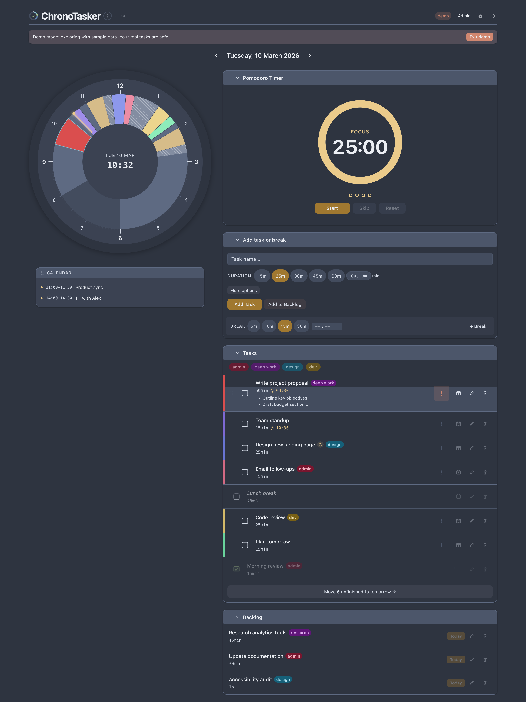

# ChronoTasker



A visual time-planning tool with an integrated Pomodoro timer. Instead of a list, your day appears as a clock face — tasks are coloured arcs so you can see at a glance how your time is allocated.

**Live at [chronotasker.dougbelshaw.com](https://chronotasker.dougbelshaw.com)** — invite-only during the testing period.

---

## What it does

- **Clock face view** — tasks sit on a 12-hour clock as arcs; you see time, not a list
- **Pomodoro timer** — 25-minute focus sessions, short breaks, long break every four cycles; sounds and notifications when cycles complete
- **Calendar feeds** — connect up to three iCal feeds; meetings appear on the clock with a configurable buffer
- **Task management** — add, edit, reorder (drag or tap), reschedule, set fixed times, mark important, tag, repeat
- **Backlog** — tasks that don't have a place today sit in a backlog until you're ready
- **Undo/redo** — undo or redo any task action
- **Offline-first PWA** — works without a connection; syncs when you're back online; installable on any device
- **Five colour schemes** — Nord, Aurora, Frost, Evergreen, Berry
- **Accessible** — keyboard navigable, screen-reader friendly

---

## Getting started

ChronoTasker is currently in testing. To get access, ask for an invite code. Once you have one:

1. Go to [chronotasker.dougbelshaw.com](https://chronotasker.dougbelshaw.com)
2. Click **Create account**, enter your email, a password (12+ characters), and your invite code
3. Install to your home screen for the best experience (works on Android, iOS, Mac, and Linux)

---

## Self-hosting

ChronoTasker is designed to be self-hosted. You run one server for yourself and any people you invite.

### Requirements

- Node.js 20+
- A server with a domain and HTTPS (Caddy works well)

### Setup

**1. Clone and install**

```bash
git clone https://github.com/your-username/chronotasker
cd chronotasker
```

**2. Configure the server**

```bash
cd server
cp .env.example .env
```

Edit `.env`:

```
JWT_SECRET=        # generate: node -e "console.log(require('crypto').randomBytes(64).toString('hex'))"
APP_ORIGIN=        # your frontend URL, e.g. https://chronotasker.example.com
OWNER_EMAIL=       # your email address
PORT=3001
NODE_ENV=production
```

**3. Build and start the server**

```bash
npm install
npm run build
node dist/index.js
```

On first run, the server creates your owner account and prints a one-time password to the console. Save it.

**4. Build the frontend**

```bash
cd ../chronotasker-app
cp .env.production.example .env.production
# Edit VITE_API_URL if your API is on a different domain
npm install
npm run build
# Serve the dist/ folder with Caddy, nginx, or any static file server
```

**5. Caddy example**

```caddy
your-domain.com {
    handle /api/* {
        reverse_proxy localhost:3001
    }
    handle {
        root * /path/to/chronotasker-app/dist
        try_files {path} /index.html
        file_server
    }
    encode gzip
    header {
        Content-Security-Policy "default-src 'self'; script-src 'self'; style-src 'self' 'unsafe-inline'; img-src 'self' data:; connect-src 'self'; font-src 'self' data:; frame-ancestors 'none'"
        X-Content-Type-Options nosniff
        X-Frame-Options DENY
    }
}
```

### Inviting users

Log in with your owner account and visit `/admin`. From there you can generate invite codes and share them with the people you want to give access to.

---

## Development

```bash
# Start the backend
cd server && npm run dev

# Start the frontend (separate terminal)
cd chronotasker-app && npm run dev
```

The frontend dev server runs on `http://localhost:5173`. The API runs on port `3001`.

### Running tests

```bash
cd chronotasker-app && npm test
```

---

## Stack

| Layer | Technology |
|-------|-----------|
| Frontend | Vite, React, TypeScript, PWA (Workbox) |
| Backend | Express, better-sqlite3, TypeScript |
| Auth | JWT (httpOnly cookies), bcrypt, rotating refresh tokens |
| Deploy | GitHub Actions → VPS, Caddy reverse proxy, pm2 |

---

## Changelog

### v1.1.0 — 2026-03-10

- **Multi-user support**: ChronoTasker now supports multiple accounts. Each user sees only their own tasks and settings.
- **Accounts**: sign up with an invite code, log in, log out. Sessions use short-lived tokens that refresh automatically.
- **Admin dashboard**: the owner account gets an admin panel at `/admin` to manage users, generate and revoke invite codes, and view an audit log.
- **Security**: passwords are hashed with bcrypt, tokens are stored in httpOnly cookies (not localStorage), and all API routes check that data belongs to the requesting user.

### v1.0.4 — 2026-03-09

- **Drag to reorder**: drag tasks up and down the list to change their order on the clock. On touch devices the up/down buttons remain available.
- **Accessibility**: screen readers now get clear descriptions for the Pomodoro timer, recurring task badge, conflict and overflow warnings, day start/end time inputs, and colour scheme options.

### v1.0.3 — 2026-03-09

- **Undo/redo**: undo or redo the last task action using Cmd+Z / Cmd+Shift+Z or the bar that appears at the bottom of the screen.
- **Tag filtering**: filter pills appear above the task list when tasks have different tags.
- **First-time onboarding**: new users see a short explanation of how the app works, with a link to try demo mode.
- **Browser notifications**: the app notifies you when a scheduled task is about to start.

### v1.0.2 — 2026-03-09

- The highlight colour now defaults to warm gold instead of blue.
- Tags are assigned distinct colours that are clearly different from each other.
- The Pomodoro timer ring and dots follow the active highlight colour.
- Demo mode shows different tasks and calendar events on different days.

### v1.0.1 — 2026-03-09

- Calendar events from other time zones now appear at the correct local time.
- The app version number is shown in the top-left corner.
- Task titles on mobile now wrap instead of being cut off.

### v1.0.0 — 2026-03-05

First release: clock face visualisation, Pomodoro timer, task management, calendar feeds, recurring tasks, backlog, colour schemes, offline sync, PWA install, help page.
